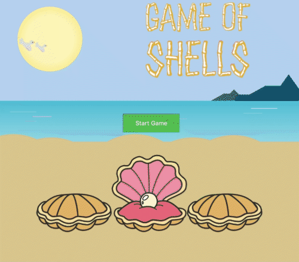

A simple game where the user needs to guess where the pearl is being held.
This project was created using React, React Hooks, Styled Components and Redux.
For the animation of the shells, the library FlipMove was used.

## Demo

## Screenshots

